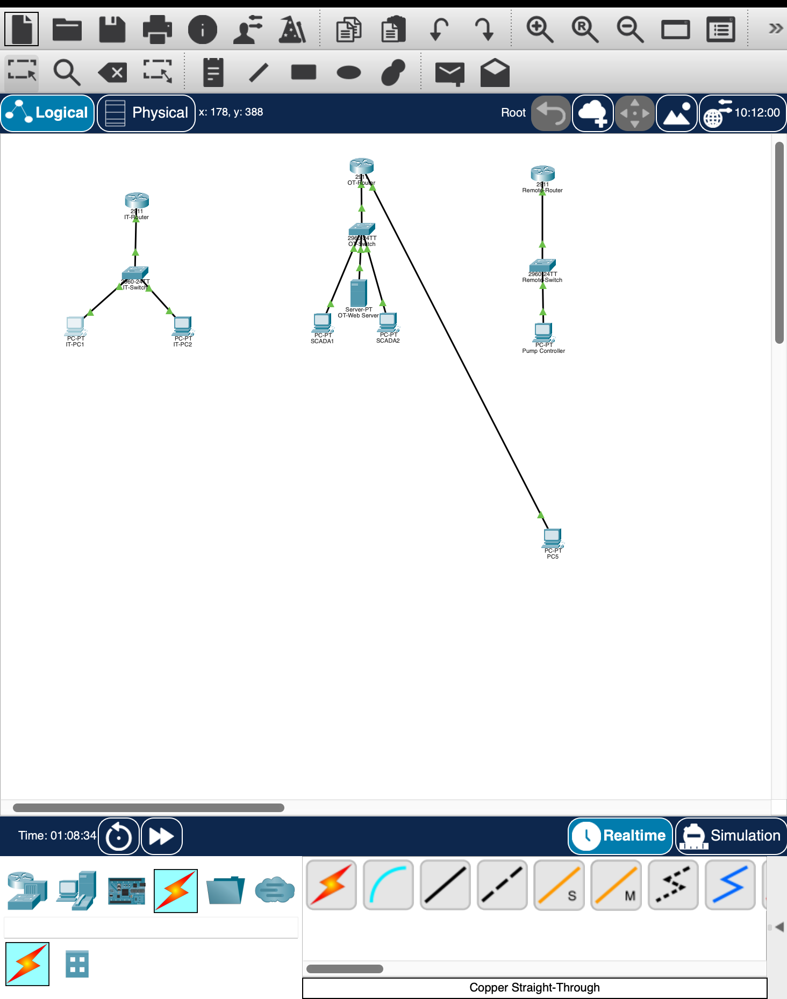
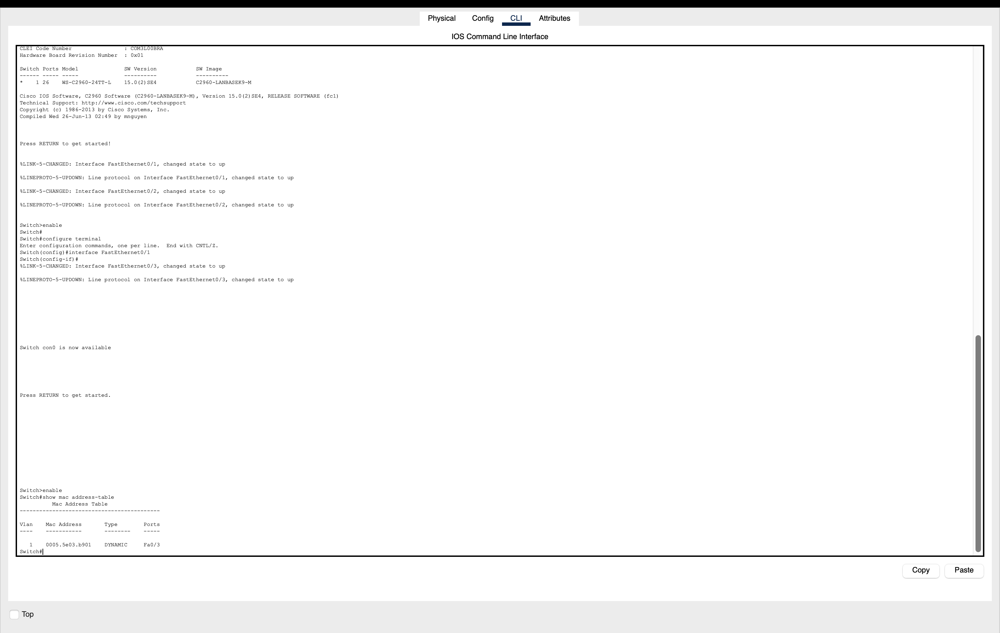
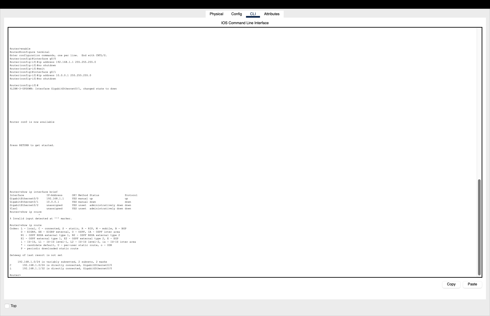
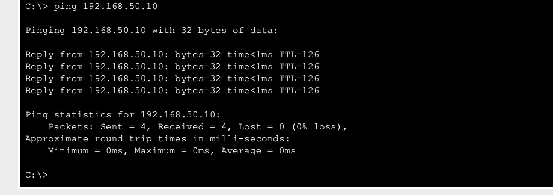
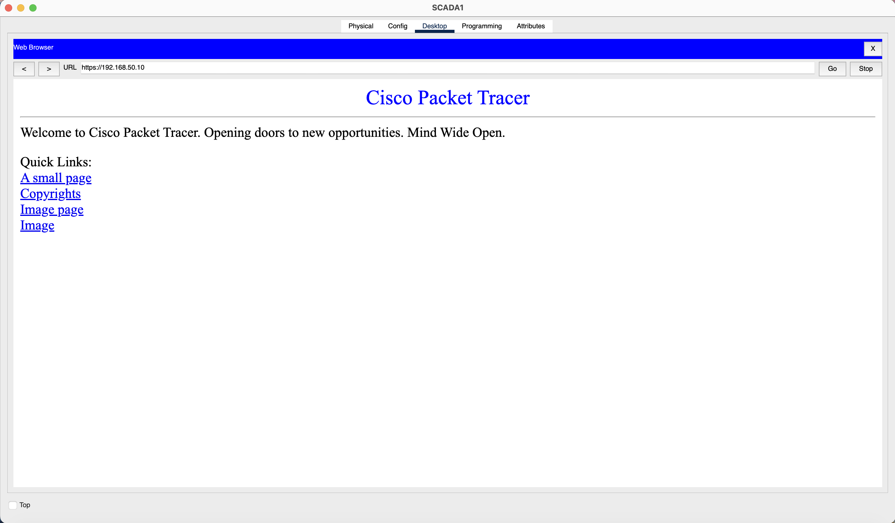
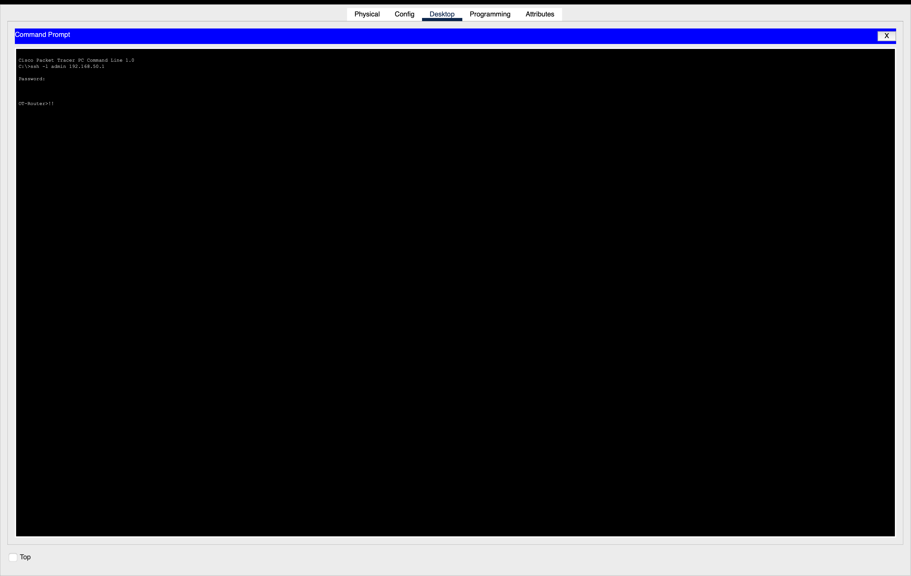
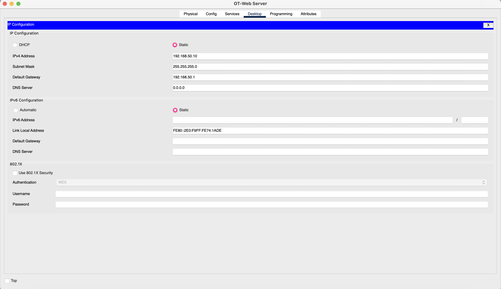
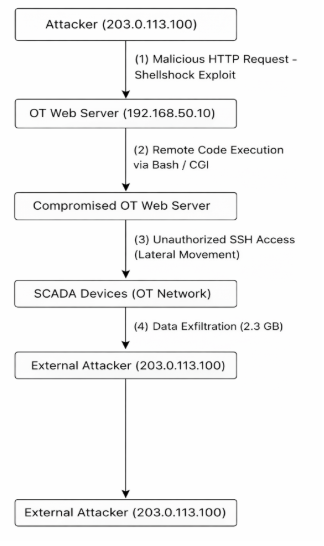

# Lab 04: Enterprise LAN Security Assessment

**Name:** Jasmine Elabyad  
**Course:** IT-335-B  
**Date:** March 17, 2026  

## Introduction

Winslow Bay Municipal Utility District (WBMUD) represents a critical infrastructure environment where secure network design is essential for protecting water and wastewater systems. In this lab, I designed a segmented enterprise LAN including IT, OT, and remote networks, and analyzed how different protocols and OSI layers contribute to both functionality and security.

The goal of this lab was to apply OSI model concepts, evaluate protocol security, and understand how vulnerabilities like Shellshock can impact real-world systems. This project demonstrates how proper network segmentation and secure configurations help protect critical infrastructure from cyber threats.

## Part 1: Network Architecture & OSI Mapping

### Step 1.1: Physical Layer (OSI Layer 1)

For this part of the lab, I created a network topology that includes three separate network segments: IT, OT (SCADA), and a remote network. Each network has its own router, switch, and devices connected to it. I connected everything using cables in Packet Tracer so that all the devices could communicate with each other. This step represents the Physical layer because it focuses on how devices are physically connected and how data moves through cables. It’s basically the starting point of the network before any configurations like IP addresses or routing are set up.

### Step 1.2: Data Link Layer (OSI Layer 2)

For this step, I looked at how the switch handles communication between devices on the same network. The switch learns the MAC addresses of connected devices and stores them in a MAC address table. This allows it to send data only to the correct device instead of sending it to all devices. The MAC address table updates automatically as devices communicate, which helps make the network more efficient. This step represents the Data Link layer because it uses MAC addresses to move data between devices within the same network. Instead of using IP addresses, the switch relies on hardware addresses to forward frames correctly.

### Step 1.3: Network Layer (OSI Layer 3)

For this step, I configured the routers by assigning IP addresses to each interface and setting up routing between the networks. This made it possible for devices on different networks, like IT and OT, to communicate with each other. I also checked the routing table to make sure all the networks were reachable and connected correctly. This step represents the Network layer because it uses IP addresses and routing to send data between different networks.

### Step 1.4: Connectivity Verification

.png)

For this step, I tested the network by using ping to check connectivity between devices. First, I pinged another device on the same network, and it worked with 0% packet loss. Then I tested a device on a different network, which was also successful. This showed that routing between the networks was working correctly. Overall, the successful ping results confirmed that all devices could communicate across the network.

## Part 2: Protocol Security Analysis (OSI Layers 4–7)

### Step 2.1: Transport Layer Security (OSI Layer 4)

For this step, I looked at how TCP and UDP work at the Transport layer and how they affect network security. TCP is connection-based, which means it uses a three-way handshake before sending data. This makes communication more reliable because both devices confirm the connection before data is sent. Because of this, TCP provides better visibility and control, which helps improve security. UDP, on the other hand, is connectionless and does not check if the receiver is ready before sending data. This makes it faster, but also less secure because there is no confirmation or tracking of the communication. Overall, TCP is generally more secure than UDP because it is more controlled and reliable, while UDP is faster but has fewer security features. This step represents the Transport layer because TCP and UDP control how data is sent between devices.

### Step 2.2: Application Layer Security (OSI Layer 7)

For this step, I compared HTTP and HTTPS to understand how security works at the Application layer. HTTP does not encrypt data, which means information sent over the network can be intercepted and read by attackers. HTTPS, however, uses encryption (TLS/SSL) to protect data while it is being transmitted. This helps keep sensitive information, like login credentials, secure. Because of this, HTTPS is more secure than HTTP and helps protect against attacks such as man-in-the-middle attacks.
To demonstrate this, I tested both HTTP and HTTPS access to the OT web server in Packet Tracer. When accessing the server using HTTP, the webpage loaded successfully, but the communication was not encrypted. When I switched to HTTPS, the same webpage was accessible, but this time the communication was encrypted, providing better protection for sensitive data. This shows the importance of using HTTPS in real-world networks.
For remote access, I compared SSH and Telnet. Telnet sends data, including usernames and passwords, in plain text, which makes it insecure. SSH encrypts all communication, which protects sensitive information from being intercepted. I tested SSH by remotely logging into the router from a PC, which demonstrated how secure remote access works in practice. Overall, these tests show how using secure protocols like HTTPS and SSH helps protect data and prevent unauthorized access.
## HTTP and HTTPS Access

### Screenshot 6a – HTTP Access to Web Server

### Screenshot 6b – HTTPS Access to Web Server

### Screenshot 7 – SSH Remote Login

## Part 3: Shellshock Vulnerability Simulation

### Step 3.1: Configure Vulnerable LAMP Server

For this step, I worked with the OT web server to simulate a vulnerable LAMP stack environment. The server includes Linux as the operating system, Apache as the web server, MySQL as the database, and PHP for processing. I also noted that a CGI script was available on the server, which is important because Shellshock targets CGI scripts that interact with the Bash shell. This setup shows a vulnerable system because it allows user input to be passed to the server without proper security controls. The Apache web server was enabled on port 80, and CGI scripting was active on the server, allowing scripts like /cgi-bin/test.cgi to be executed.

### Step 3.2: Shellshock Exploit Simulation

For this step, I simulated a Shellshock attack from the attacker node to the OT web server. The attack works by sending a specially crafted HTTP request that includes a malicious Bash command inside a user agent field. When the web server processes this request, it passes the input to a CGI script, which then interacts with the Bash shell. Because of the Shellshock vulnerability, the Bash shell would execute the malicious command instead of ignoring it. This shows how an attacker can run commands remotely on a vulnerable system without needing authentication.

### Step 3.3: Attack Analysis & Mitigation

For this step, I analyzed the Shellshock vulnerability and demonstrated how it could be exploited using a simulated attack in Packet Tracer. The Shellshock vulnerability allows attackers to execute commands on a system remotely by taking advantage of how the Bash shell processes environment variables. Since CGI scripts often pass user input to the Bash shell, an attacker can insert malicious commands that the system may execute without proper validation.

In the simulation, I attempted to send a crafted HTTP request from the attacker PC to the OT web server using a curl command targeting the CGI script. However, Packet Tracer does not support full Linux command execution, so the command returned an "Invalid Command" message. To represent the expected behavior of a real attack, I included a simulated output showing “Shellshock Vulnerable.”

Even though the exploit could not fully execute in Packet Tracer, this still demonstrates how the attack would work in a real environment. One of the biggest risks of this vulnerability is that it does not require authentication, meaning an attacker can exploit it without needing login credentials. This makes it especially dangerous for public-facing servers like web applications.

To mitigate this vulnerability, several security measures should be implemented. First, systems should always be updated and patched to fix known vulnerabilities like Shellshock. Second, input validation should be enforced to ensure that user input is not directly passed into system-level commands. Additionally, unnecessary CGI scripts should be disabled or restricted since they are common targets for exploitation.

Organizations like the SEI CERT Coordination Center help identify and report vulnerabilities like Shellshock. They provide official vulnerability notes, such as VU#252743, and work with vendors to coordinate fixes and patches. This helps organizations respond quickly and reduce the risk of widespread attacks.

Other protections include using firewalls and intrusion detection systems (IDS) to monitor and block suspicious traffic, as well as implementing network segmentation to isolate critical systems. Overall, this lab shows how even though the attack was simulated, vulnerabilities like Shellshock can lead to serious security risks if not properly addressed.

## Part 4: Security Incident Response Exercise

### Step 4.1: Attack Path Reconstruction

#### Attack Path Diagram

I analyzed how the attacker would move through the network based on the incident details and the Shellshock vulnerability. The initial access would likely occur when the attacker (203.0.113.100) sends a malicious HTTP request to the OT web server (192.168.50.10) targeting the CGI script. Because the server is vulnerable to Shellshock, the Bash shell would execute the attacker’s command, giving them remote access.

After gaining access, the attacker would have the same privileges as the web server, allowing them to run commands and explore the system. From there, they could create unauthorized SSH sessions to SCADA devices in the OT network. This demonstrates lateral movement, where the attacker moves from one compromised system to other devices.

The data exfiltration would likely occur from the OT web server directly to the external attacker IP. Since there are no strong monitoring or restrictions, the attacker could transfer large amounts of data without being detected. This shows how a single vulnerability can lead to a full network compromise.

### Step 4.2: Root Cause Analysis (OSI Layers)

For this step, I analyzed the root causes of the attack based on the OSI model. The main vulnerability exists at the Application layer (Layer 7), where the Bash shell processes input from CGI scripts without proper validation. This allowed the attacker to inject malicious commands through an HTTP request. At the Network layer (Layer 3), there were also security weaknesses because there were no restrictions preventing external devices from accessing the OT web server. This made it possible for the attacker to reach the vulnerable service. At the Transport layer (Layer 4), the use of HTTP instead of HTTPS meant that communication was not encrypted, which increased the risk of exploitation. Overall, the attack was successful due to a combination of poor input validation, lack of patching, and weak network security controls.

### Step 4.3: Mitigation & Defense Strategy

To prevent this type of attack, several security measures should be implemented. First, systems should be regularly updated and patched to eliminate known vulnerabilities like Shellshock. Keeping software up to date is one of the most important ways to maintain security.

Second, input validation should be enforced to ensure that user input is not directly passed into system-level commands. This helps prevent command injection attacks.

Third, unnecessary CGI scripts should be disabled or restricted, since they are commonly targeted by attackers.

In addition, network security should be improved by using firewalls and access control lists (ACLs) to limit which devices can communicate with critical servers. Using HTTPS instead of HTTP would also provide encryption and improve overall security.

Finally, intrusion detection systems (IDS) and monitoring tools should be used to detect suspicious activity and respond to potential threats. Network segmentation can also reduce risk by isolating sensitive systems from less secure parts of the network.

## Part 5: Reflection

This lab helped me understand how the different layers of the OSI model work together in a real network and how vulnerabilities at one layer can affect the entire system. I learned how important it is to properly configure and secure each part of a network, especially at the Application layer where many attacks occur.

The Shellshock vulnerability showed how dangerous it can be when user input is not properly validated. Even a small misconfiguration can allow attackers to gain remote access to a system.

Overall, this lab reinforced the importance of patching systems, validating input, and using security tools like firewalls and IDS. It also helped me understand how attackers move through a network and how proper defenses can prevent these types of attacks.
